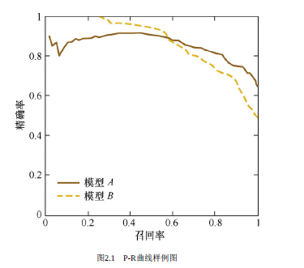

```
 __  __            _     _            
|  \/  | __ _  ___| |__ (_)_ __   ___ 
| |\/| |/ _` |/ __| '_ \| | '_ \ / _ \
| |  | | (_| | (__| | | | | | | |  __/
|_|  |_|\__,_|\___|_| |_|_|_| |_|\___|
                                      
 _                          _             
| |    ___  __ _ _ __ _ __ (_)_ __   __ _ 
| |   / _ \/ _` | '__| '_ \| | '_ \ / _` |
| |__|  __/ (_| | |  | | | | | | | | (_| |
|_____\___|\__,_|_|  |_| |_|_|_| |_|\__, |
                                    |___/ 
```
[toc]

# 西瓜书
## 第一章 绪论

<p style="text-align: center;"></p>
机器学习是什么:  
利用经验改善系统性能

### 基础概念

| 术语                 |                                                       |
|----------------------|-------------------------------------------------------|
| 监督学习vs无监督学习 | 监督学习:训练数据有标签                               |
| 分类,回归,聚类       | 回归:目标标签是连续值 聚类:将训练集中的样本分为若干簇 |
| 数据,样本,标签       |                                                       |
| 假设空间             | g的候选集合,学习过程就是从假设空间进行搜索的过程      |
| 版本空间             | 与训练集一致的假设的集合                              |


### NFL定理

没有免费的午餐定理:  
一个算法若再某些问题上比另一个算法好,则一定存在另一些问题,使后一算法优于前者  

$$
E_{ote}(\mathfrak L_a | X,f) = \sum_h \sum_{x \in \mathcal X-X} P(x)\mathrm{II}(h(x) \neq f(x))P(h | X, \mathfrak L_a)
$$

### 习题

1.2 穷举法程序见./programs  

## 第二章 模型评估

<p style="text-align: center;"></p>

### 基础概念

<p style="text-align: center;"></p>
训练数据分层  

1. 训练集:用来训练模型,模型的迭代优化
2. 验证集:调整超参数,优化模型
3. 测试集:不参与训练流程,检测模型效果

经验误差和泛化误差  

1. 经验误差:训练集上的误差
2. 泛化误差:在"未来"样本上的误差,对应测试集数据
3. 验证集:调整超参数

偏差和方差

1. 偏差(bias)期望值和实际值的差值
2. variance模型预测值的方差(整体散度)
3. Err(x) = Bias*2 + Variance + Irreducible Error

模型越复杂,模型拟合能力越强,偏差逐渐变小,容易过拟合  
模型越复杂,可能性越多,方差越大

### 混淆矩阵

* 二分类数据集包含正例和负例
* 模型分类后包含预测正例和预测负例
* 由此共四种数据集合

<table>
	<tr>
		<td colspan="2" rowspan="2"></td><td colspan="2">Actual Values</td>
	</tr>
	<tr>
		<td>Positive (1)</td><td>Negative (0)</td>
	</tr>
	<tr>
		<td rowspan="2">Predicted Values</td><td>Positive (1)</td><td>TP</td><td>FP</td>
	</tr>
	<tr>
		<td>Negative (0)</td><td>FN</td><td>TN</td>
	</tr>
</table>

#### 根据混淆矩阵得到的评价指标

查全率是分类正确的正样本占真正正样本个数的比例  
即召回的数据中,对正样本的覆盖率  
$$
Recall = TP/(TP+FN)
$$

查准率是指分类正确的正样本个数占分类器判定为正样本的样本个数的比例  
$$
Precision = TP/(TP+FP)
$$

Recall和Precision是既矛盾又统一的两个指标,为了提高Precision,分类器往往需要在"更有把握"时才将样本预测为正样本,但也因此过于保守而漏掉很多"没有把握"的正样本,导致Recall值降低  

##### PR曲线

在某一阈值下,模型将大于该阈值的视作正样本,小于该阈值的视作负样本,此时返回结果对应一组Precsion和Recall.通过将阈值从高到低移动,获得一系列的PR值,以查全率为横坐标,查准率为纵坐标,可得PR曲线.一个P-R曲线如下图,横坐标为0时阈值最大.  

<p style="text-align: center;"></p>

准确率是指分类正确的样本占总样本的比例  
$$
Accuracy = (TP+TN) / Total
$$

F1是查全率和查准率的调和平均  
$$
F1 = 2*Recall*Precision/(Recall+Precision)
$$

##### 阈值的选择

1. 使用平衡点 R=P
2. F1度量
3. Fbeta

$$
F_{\beta} = \frac{(1+\beta)^2PR}{(\beta ^2 P)+R}
$$

##### ROC曲线,AUC（Area Under Curve）

**ROC**  
  
ROC曲线即"受试者工作特征曲线”,它的横坐标是假阳性率,纵坐标为真阳性率  

$$
FPR = \frac{FP}{N} \\
TPR = \frac{TP}{P}
$$

ROC曲线针对于二值分类问题,在此类问题中,模型的输出一般是预测样本为正例的概率.样本按照预测概率高低排序,在输出最终的正例和负例之前,需要指定一个阈值,预测概率大于阈值的样本会被判定为正例.  
这里,我们将这个阈值叫做"截断点",通过动态的调整截断点,每一个截断点都会对应一个FPR和TPR,在ROC图上绘制出每个截断点对应的位置,连接所有点就得到最终的ROC曲线.  

**AUC**  
  
AUC为ROC曲线下的面积,能够量化的反映基于ROC曲线衡量出的模型性能.当ROC曲线为通过(0,0)和(1,1)的直线时,认为二值分类完全随机.当ROC曲线为通过(0,1)的折线时,分类最好,此时AUC最大.  

**ROC与P-R曲线对比**  
  
当正负样本分布发生变化时,ROC形状能基本保持不变,而P-R曲线的形状一般会剧烈变化.  
所以ROC曲线能够尽量降低不同测试集带来的干扰.  

### 参考资料

《统计学习方法》1.4-1.6  
《百面机器学习》第二章
