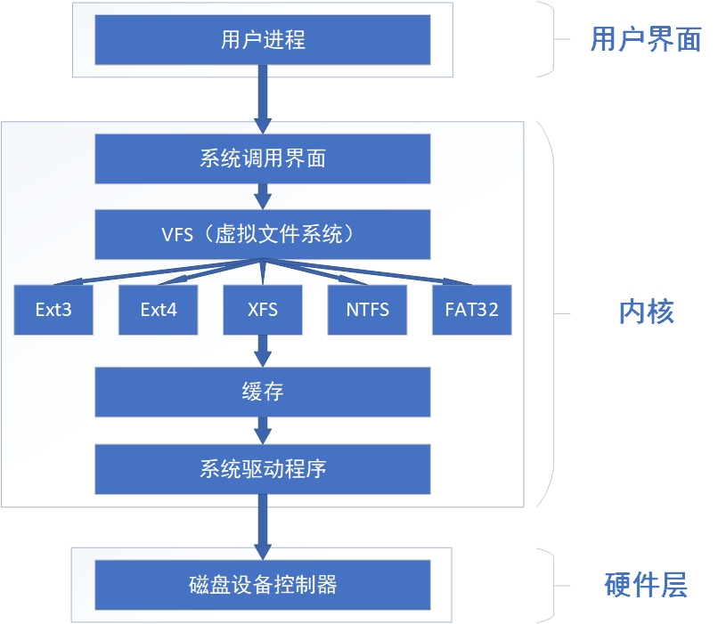

[toc]

## chapter 2

### system related commands
#### systemctl
* start
* stop
* restart
* enable
* disable

#### reboot
#### poweroff
#### date
#### timedatectl
* set-time
* set-timezone
#### uname
unix name, show kernel info  
* a: all info, time is the time when the kernel is packaged

### process related commands
#### ps
* aux: to see every process on the system using BSD syntax
#### pstree
like ps, but show process in a tree
#### pidof
show pid(s) of a process
#### kill
kill certain process with given pid
#### killall
kill certain service with all its pids

### states of process in Linux
| state | meaning                   | description                                                                                |
|-------|---------------------------|--------------------------------------------------------------------------------------------|
| R     | TASK_RUNNING              | ready or running                                                                           |
| S     | TASK_INTERRUPTIBLE        | waiting, suspended                                                                         |
| D     | TASK_UNINTERRUPTIBLE      | to avoid process being interrupted e.g. in kernal mode, this state is hardly catched by ps |
| Z     | TASK_DEAD - EXIT_ZOMBIE   | all resources being recycled, except task_struct which contains info as exit_code          |
| X     | TASK_DEAD - EXIT_DEAD     | all resources being recycled                                                               |
| T     | TASK_STOPPED, TASK_TRACED |                                                                                            |

### system resources related
#### top
##### first line
load average: average length of queue for 1, 5, 15 mins
##### cpu line
us: usage, id: idol
#### uptime
first line of top, user number in redhat 7 is the num of terminals(bug)
#### free
show memory usage
* h: human readable
#### nice
* n [niceness_value] [command]: launch a program with altered priority

### user/network related
#### who/w
show current users loging in 
#### last
show log-in history  
not safe, command will save result in /var/log/lastlog
#### ifconfig
if for interface  
| important info | meaning                                      |
|----------------|----------------------------------------------|
| first para     | name for network device                      |
| inet/inet6     | ip address                                   |
| ether          | mac address                                  |
| rx/tx          | statistics for data received and transmitted |

#### ping
in linux, ping will work continuously
#### tracepath
trace route in linux
#### netstat
* a: show all, including listening and non-listening
* n: show numeric(ip address), instead of symbolic host, port or user names

### console/file related
#### pwd
Print current Working Directory
#### cd
* -: change to the last used directory
#### ls
* a: all, including hidden(start with .)
* l: long, detailed info
#### tree
show hierachy tree for directory
#### file
show file type  
in linux, file is not distinguished through appendix
#### finders
everything inside linux is a file
| command name | detail                      |
|--------------|-----------------------------|
| find         | real time search            |
| locate       | search in database          |
| whereis      | binary, source, manual page |
| which        | only find shell commands    |

##### find
real time search  
* -name: name for file name
* -user: files that belong to the given user
* -exec: execute the command after each search, {} for searched results
e.g. `find -user linuxprobe -exec cp -a {} /root/findresults/ \;`  
##### locate
will update database then search in database  
can use **updatedb** to manualy update
1. cannot find all files
2. faster than find
#### file content
| command | name                                               |
|---------|----------------------------------------------------|
| cat     | contatenate content of file to terminal            |
| more    | cat in page mode, suitable for large files         |
| head    | -n [num]: to show head num lines for file          |
| tail    | similar to head, but tail lines, -f: to auto flush |

to fetch middle lines of a file: use pipe  
e.g. head -n 15 file | tail -n 5  
to show line 10-15
#### tr
translate  
e.g. tr [a-z] [A-z]  
find a-z and change them to capital alphabets
#### wc
words count  
* l: lines
* w: words
#### stat
show detailed file info
| name  | description                                                       |
|-------|-------------------------------------------------------------------|
| ATime | Access time, last time file accessed                              |
| CTime | Change time, last time file attributes changed e.g. location,mode |
| MTime | Modified time                                                     |

#### grep
* n: show nu
* v: inverted
print lines matching pattern
#### cut
divide text in columns and print
#### diff
show difference between files  
* brief: dont show details of difference
#### uniq
report or omit repeated lines  
**file is not changed, only shown in terminal in default**
#### sort
* n: sort in numeric form
#### touch
change file timestamps  
usually used to create text file
#### mkdir
* p: make parents if dont exist
#### cp
* r: recursive
#### dd
convert and copy file  
or copy with some conditions  
this command can be used to copy blocks  
for instance, copy from /dev/zero to create files of random size  
copy from cdrom to create iso file  
#### mv
#### rm
#### history
show history of commands  
1. will not clear when poweroff
2. will not update real-time
3. will show commands with num, commands can be called ![num]
* c: clear history
#### sosreport
collect and pack system info
#### tar
* czvf: pack, c for create, z for gzip, v for visualize, f for file
* xzvf: unpack, x for extract
z is not necessary now, tar can automatically distinguish file type

## chapter 3

### 输入重定向
* 清空输入重定向 < 文件
* 从标准输入读入,直到分界符 << 分界符

### 输出重定向

* 清空 >
* 追加 >>

1. 标准 1>
2. 错误 2>
3. 不加以区分 &>

### shell变量操作
| sign   | description        |
|--------|--------------------|
| =      | 赋值               |
| $      | 取变量值           |
| $$     | 取pid              |
| \|     | 管道符             |
| *      | 全通配             |
| ?      | 匹配任意一位       |
| ^      | 开头               |
| $      | 结尾               |
| []     | 里面的任一字符     |
| {}     | 序列,显示报错      |
| ""     | str                |
| ''     | 全局转义字符串     |
| ``     | 执行命令并返回结果 |
| alias  | 设置别名           |
| type   | 查看命令类型       |
| unset  | 取消变量           |
| export | 导出为全局变量     |
| tee    | 保存至文件         |

**通配符由shell先解释再执行**  
e.g.  
```
echo 123456 | passwd --stdin linuxprobe
# 更改linuxprobe用户的密码为123456
# history可以看到明文
```

### shell优先级
从高到低  
1. 绝对路径的执行命令
2. 别名命令
3. 内部命令
4. 外部命令

### 常用shell变量
* HOME
* SHELL
* HISTSIZE
* LANG
* RANDOM 生成随机uint
* PSI 提示符

## chapter 4
### shell 脚本
最基本的shell脚本可以视作命令的堆砌  
其改良有如下两个方向:  

1. 耳朵,接收
2. 大脑,判断

其中,1可以通过传递参数实现,如下  

| 变量 | 内容                    |
|------|-------------------------|
| $#   | 参数个数                |
| $0   | 脚本本身的名称          |
| $1   | 传递给脚本的第一个参数  |
| $*   | 全部参数                |
| $@   | 全部参数,不过是分开传递 |

2可以通过条件语句等实现  

#### shell基本运算

1. 算术运算符
2. 关系运算符
3. 布尔运算符
4. 字符串运算符
5. 文件测试运算符

原生bash不支持简单的数学运算,但可以通过其它命令比如expr,awk实现  

关系运算符  
| expr | meaning          |
|------|------------------|
| -eq  | equal            |
| -ne  | not equal        |
| -gt  | greater than     |
| -lt  | less than        |
| -ge  | greater or equal |
| -le  | less or equal    |

布尔运算符  
| expr | meaning |
|------|---------|
| !    | not     |
| -a   | and     |
| -o   | or      |

逻辑运算符  
&&,||  

```
if [ $VALA -eq 10 -a $VALB -eq 20]; then
	# do sth
fi


if [[ $VALA -eq 10 && $VALB -eq 20]]; then
	# do sth
fi
```

shell中使用这两个符号时,注意也可以表示为前一语句执行成功才执行后一语句;前一语句执行失败才执行后一语句  

```
[ ! $USER = root ] && echo "user" || echo root
```

文件测试
| expr | meaning                           |
|------|-----------------------------------|
| -d   | check if is dir                   |
| -e   | check if exists                   |
| -f   | check if is normal file           |
| -r   | check if current user can read    |
| -w   | check if current user can write   |
| -x   | check if current user can execute |

字符串操作  
| expr | meaning                              |
|------|--------------------------------------|
| =    | judge if strings are equal           |
| !=   | judge if strings are not equal       |
| -z   | judge if string's length is zero     |
| -n   | judge if string's length is not zero |
| $    | judge if string is null              |

test,[属于bash内置命令,而[[属于bash关键字,所以[[可以使用通配符,以及数学运算  

#### shell流程控制
```
#!/bin/bash

for I in 1 2 3
do
	echo $I
done

for ((I=1;I<=3;I++))
do 
	echo $I
done

I=1
while [[ $I -le 3 ]]
do
	echo $I
	I=`expr $I + 1`
done

I=1
until [ $I -gt 3 ]; do
	echo $I
	I=`expr $I + 1`
done

echo "I is $I"
if [ $I -eq 1 ]
then
	echo "I is 1"
elif [ $I -eq 2 ]
then
	echo "I is 2"
elif [ $I -eq 3 ]
then
	echo "I is 3"
else
	echo "I is greater than 3"
fi

case $I in
	1)
		echo "I is 1"
		;;
	2)
		echo "I is 2"
		;;
	3)
		echo "I is 3"
		;;
	*)
		echo "I is not 1, 2 or 3"
		;;
esac
```

### 计划任务

* 一次性: at
* 多次性: crond服务


#### at
echo "命令字符串" | at [time]  

```
echo "reboot" | at +2 MINUTE
echo "reboot" | at 19:00
```

删除可用atrm  

#### crond
服务采用crontab进行配置  
```
minute hour date month weekday command
*      *    *    *     *       [command]
*/2    # every two minute
1-5    # at 1,2,3,4 or 5 minute
1,2    # at 1 or 2 minute
```

* 建议不要直接修改配置文件,因为crontab会进行检查  
* 命令使用绝对路径

## chapter 5

### linux中的用户

uid0：root  
uid1-999：系统用户，linux系统服务多半使用独立系统用户运行，以保证控制被害  
uid1000-：普通用户  

每个用户都有基本组与扩展组，基本组在创建用户时即创建，只有用户一个组员，往往与用户同名。  
扩展组则是后天指定的。  

#### 用户与组管理指令

| 指令     | 描述             | 常用参数                        |
|----------|------------------|---------------------------------|
| id       | 查看用户和组信息 |                                 |
| useradd  | 添加用户         | -G 指定拓展组，-s 指定默认shell |
| usermod  | 改变用户状态     | -L -U 锁定解锁                  |
| userdel  | 删除用户         |                                 |
| groupadd | 创建新的用户组   |                                 |
| passwd   | 修改用户密码     |                                 |

### 文件权限管理

#### 权限概述
基本的权限有rwx，分别为读，写，执行  
对于dir而言：  

* 读：获取目录里文件列表
* 写：更改目录里文件列表（删除目录内文件需要此权限）
* 执行：进入该目录

具体而言：  

|   | 文件     | 目录  |
|---|----------|-------|
| r | cat      | ls    |
| w | vim      | touch |
| x | ./script | cd    |

#### 权限分类
对于文件，往往有类似如下的文件权限信息：  
```
dwrs-r---T+
```
其中第0位表示文件类型，后9位，3组信息对应所属用户，所属组，其它用户的权限。  
若为x则表示执行权限，s或t表示有执行权限与特殊权限，S或T表示有特殊权限无执行权限。  
+表示文件访问控制列表设定，.表示没有。  
注意：**隐藏权限**不在此处显示。  
上述的字母也可以用三位或四位数字表示，如755  

linux中文件的权限如下：  

1. 基本权限
2. 特殊权限 suid sgid sbit
3. 隐藏权限
4. 文件访问控制表 facl

命令：  

```
chmod：chmod -R 777 文件，chmod o+t 文件
chown：chown [-R] 所有者:所有组 文件
```

#### 特殊权限
suid(set user id)：进程的发起者，同文件的属主，则应用文件属主权限。设置suid即允许用户以该文件的属主的权限执行该文件（此时进程发起者为属主），如系统的passwd，需要更改/etc/passwd，/etc/shadow。只针对二进制文件。  
guid(set group id)：对文件设置时，与suid类似。对目录设置时，目录内新创建文件自动继承该目录原有组的名称。  
sbit(set bit)：保护位/粘滞位。针对目录，设置后目录内文件只有属主才能删除。  

#### 隐藏权限

通过setattr，lsattr设置和显示  
setattr +属性 文件  
setattr -属性 文件  

#### 文件访问控制表

针对单一用户或用户组设置权限。  
setfacl  
getfacl 不能使用绝对路径  

使用getfacl对权限备份和恢复：  
```
getfacl -R [dirname] > backup.acl
setfacl --restore backup.acl
```

### su命令，sudo服务

```
su - [username]
```
\-的意思是完全切换  

有时候会存在如下情况：  

1. 不想给root密码（su）
2. 不想给全部授权（su）
3. 不想所有用户均由对一个命令的授权（suid）

所以采用sudo服务对管理员授权进行控制。  
```
visudo
```
注：**建议写至100行以后**  

用户名     访问域 使用谁的身份 可执行命令（**绝对路径**）  
[username] ALL =  (ALL)         ALL  

1. 逗号，而不要用ALL指定命令
2. 不要授权文件查看和编辑命令如cat，vim

## chapter 6

### 概述

linux中一切都是文件，且一切文件都是从根目录开始的，按照文件系统层次标准(FHS)采用树状结构来存放，并定义了常见目录的用途。  
| dir    | content                                 |
|--------|-----------------------------------------|
| /boot  | kernel,startup menu and configs         |
| /dev   | store devices and interfaces files      |
| /etc   | config files                            |
| /home  | home dir for users                      |
| /root  | home dir for root                       |
| /media | mounted devs                            |
| /tmp   | "share" dir                             |
| /var   | files that alter often, e.g.  logs      |
| /bin   |                                         |
| /sbin  | binary files for startup use            |
| /lib   | func libs thta /bin /sbin commands call |

linux系统中，文件系统信息写入super block中。每个文件有一个inode记录权限与属性等记录，而实际文件存放在block中。  

物理设备 -> 分区 -> 格式化 -> 挂载

### 物理设备

系统内核中udev设备管理器会自动把硬件名称规范起来。  
| dev              | file_name |
|------------------|-----------|
| IDE              | hd[a-d]   |
| SCSI/SATA/U-disk | sd[a-z]   |
| virtio           | vd[a-z]   |
| floppy disk      | fd[0-1]   |
| cdrom            | cdrom     |
| printer          | lp[0-15]  |

硬盘的主分区或拓展分区编号从1到4，逻辑分区编号从5开始。  

<p align="center"></img></p>

扇区大小512B，除主引导记录（MBR）外仅能存放4个分区信息，若分区信息指向分区，则为主分区，若指向存放存放分区信息的扇区，则为拓展分区。拓展分区内存放的是逻辑分区的信息。  

### 文件系统

ext4与xfs比较常用，二者均为日志文件系统。  

<p align="center"></img></p>

### 磁盘操作

| 操作                         | 指令      | 说明                                   |
|------------------------------|-----------|----------------------------------------|
| 查询设备信息                 | blkid     | UUID 类型等                            |
| 分区管理                     | fdisk     | fdisk -l                               |
| 格式化                       | mkfs      | mkfs.xx xx为格式信息 如mkfs.xfs        |
| 交换区格式化                 | mkswap    |                                        |
| 激活交换分区                 | swapon    | 重启不保留，需要修改fstab              |
| 挂载                         | mount     | -a 挂载fstab 开机自动挂载修改fstab即可 |
| 卸载                         | umount    | 后跟挂载目录或设备文件均可             |
| 查询挂载设备（文件系统）信息 | df        | -h 人类可读 -T 类型 显示挂载设备及容量 |
| 查看已挂载设备使用情况       | lsblk     | 树状图显示                             |
| 分区信息同步到内核           | partprobe | 用于fdisk分区后/dev中没有设备文件      |
| 查看文件占用                 | du        | -s 摘要 -h 人类可读 e.g. du -sh /*     |

/etc/fstab：  
fstab字段含义如下：  
设备文件（或UUID）	挂载目录	格式类型（如xfs，iso9660）	权限选项（defaults）	备份（0为不备份）	自检（0为不自检）  
特别注意：网络存储设备权限选项要加上_netdev，这样系统会在联网后再挂载  

### 磁盘容量配额

针对用户或组限制最大硬盘空间或最大文件数。  
使用quota技术，限制分为两种：  

1. 软限制，到达限制时会提示用户
2. 硬限制，到达限制时会提示用户，且强行终止用户操作

RHEL8系统中已经安装了quota服务，但默认没有开启。若要开启，**fstab中给挂载设备加上uquota项并重启**。  

| bsoft | isoft |
|-------|-------|
| bhard | ihard |

bsoft: block soft, ihard: inode hard etc.  

针对xfs文件系统，可以使用xfs_quota来设置quota，一个典型示例如下：  
```
xfs_quota -x -c 'limit bsoft=3m bhard=6m isoft=3 ihard=6 tom' /boot
```
其中x为专家模式，c为参数形式设置。  

此外，可以使用edquota来管理磁盘配额。  
-u 针对用户，-g 针对组...  

### VDO虚拟数据优化

VDO（virtual data optimize），通过压缩或删重来优化存储空间，可以部署在文件系统下作为附加存储层使用。  

<p align="center"></img></p>

在部署虚拟机或容器时，建议采用逻辑存储与物理存储为10∶1的比例进行配置，即1TB物理存储对应10TB逻辑存储；而部署对象存储时 （例如使用Ceph）则采用逻辑存储与物理存储为3∶1的比例进行配置，即使用1TB物理存储对应3TB逻辑存储。  
一个vdo参考部署如下：  
```
# add vdo logical storage
vdo create --name=storage --device=/dev/sdc --vdoLogicalSize=200G
# check status
vdo status --name=storage
vdostats --human-readable
```
vdo逻辑存储可以作为设备格式化和挂载，其设备文件在/dev/mapper下，可以使用df查看占用（逻辑）。  

### 链接
软硬链接  

```
ln [-s] src target
```

<p align="center"></img></p>

## chapter 7

### Raid

常见raid：  
* 0
* 1 备份
* 5 轮流存储奇偶校验
* 10 raid 1，然后raid 0

RHEL中使用mdadm（multi device admin）命令来管理管理raid。  

#### 创建raid

```
mdadm -Cv [raid file name] -n [num] -l [raid type] -x [num] [devices]
```
\-C为create，v为过程可视化，n为指定组成raid的数量，l为raid类型，x为热备盘数量  
命令执行完后可能需要时间来初始化等，可以使用：  
```
mdadm -D [raid file name]
```
来查看raid目前状态。  

当需要往raid中填加磁盘时，可以使用：  
```
mdadm -a [device]
```

一切完成后可以正常将raid格式化和挂载，就像操作普通硬盘分区。  

#### 删除raid

再raid卸载（umount）后，先将raid中的硬盘设置为错误状态，再逐个移出，最后--stop整个阵列：  
```
mdadm -f [devices]
mdadm -r [devices]
mdadm --stop [raid file name]
```

### LVM

LVM（logical volume manager），通过将物理卷看作资源池，在其上划分逻辑卷，以实现动态的扩容缩容。  
| 功能 | physical volume | volume group | logical volume |
|------|-----------------|--------------|----------------|
| 扫描 | pvscan          | vgscan       | lvscan         |
| 建立 | pvcreate        | vgcreate     | lvcreate       |
| 显示 | pvdisplay       | vgdisplay    | lvdisplay      |
| 删除 | pvremove        | vgremove     | lvremove       |
| 扩展 |                 | vgextend     | lvextend       |
| 缩小 |                 | vgreduce     | lvreduce       |

注意：逻辑卷**不应格式化为xfs格式**，因为xfs格式不支持缩小，且自带扩容xfs_growfs  

#### lvm创建

首先声明存储设备为pv，然后创建vg作为存储资源池，再从资源池内划分部分作为lv  
```
pvcreate [device name]
vgcreate [vg name] [pv device names]
lvcreate -n [lv name] -L [size] [vg name]
```

逻辑卷位置在/dev/[vg name]/[lv name]  
随后便可以正常格式化和挂载  

#### lv扩容

首先要**卸载**lv，然后使用lvextend扩容，随后检查文件系统完整性，最后重置文件系统容量：  
```
umount [lv file]

lvextend -L [new size] [lv file]

# -f for force checking even if marked clean
# ext 2/3/4 file system checker
e2fsck -f [lv file]

# resizer for ext 2/3/4 file system
resize2fs [lv file]
```

之后就可以重新挂载使用。  

#### lv缩容

与扩容不同，应先检查文件系统完整性，文件系统缩容，再逻辑卷缩容：  
```
umount [lv file]

e2fsck -f [lv file]
resize2fs [lv file] [new size]

lvreduce -L [new size] [lv file]
```

#### lv快照
1. 快照容量必须等同逻辑卷容量
2. 快照卷仅有效一次，执行还原后会被删除

拍摄快照时不需要卸载：  
```
# -s for snap -n for name
lvcreate -L [size] -s -n [snapname] [lv file]
```

恢复快照时需要卸载，不需要指明要恢复的逻辑卷，系统会自动分辨：  
```
umount [lv file]
lvconvert --merge [snap file]
```

#### lvm删除
依次删除lv，vg，pv  

## chapter 8

### 网卡配置

#### 使用配置文件

/etc/sysconfig/net......scripts/ifcfg-[网卡名]  
如果没有改文件，应先使用ifconfig查询网卡名，再手动添加  
更改后要通知相关服务重读配置，再启用网卡。  
```
nmcli connection reload
nmcli connection up [if name]
```

#### nmtui（推荐）

Network Manager Text UI  
图形化配置，配置结束后要手动up网卡。  

#### nm-connection-editor

类似，配置结束后要手动up。需要系统图形化界面支持。  

#### 系统设置

无需手动up。  

#### cockpit
```
# ensure cockpit is installed
dnf install cockpit
# start cockpit
systemctl restart cockpit
systemctl enable cockpit
# enable cockpit socket
#systemctl enable cockpit.socket
```
然后访问本机地址的9090端口就可以网页显示cockpit  

### 防火墙配置

防火墙大致需要注意三条链：INPUT，OUTPUT，FORWARD  
在RHEL8中，防火墙的配置可以使用：  
1. iptables
2. firewalld服务

**考试时，若指定端口，不指定协议，则tcp和udp均需配置。**  

#### iptables（不推荐）

iptables针对数据链路层，会维护一张规则表，其中靠上的规则会优先执行。  
针对数据的策略，大致可以分为：
1. ACCEPT
2. DROP 拒绝，无回显
3. REJECT 拒绝，有回显
4. LOG

RHCE认证考试时应使用REJECT，不然无从得知是网卡配置问题还是数据包被无视。  
常用参数：  
| 参数 | 功能                     |
|------|--------------------------|
| -L   | 查看规则                 |
| -F   | 清空规则                 |
| -I   | 在头部插入规则（高优先） |
| -A   | 尾插规则（低优先）       |

注意：iptables的规则更改是runtime，需要使用iptables-save以让其重启后保持生效。  

#### firewalld服务

该服务以zone（区域）的概念对规则划分，有以下原因：  
1. zone作为模版提高配置复用性和效率
2. zone可以针对不同网卡进行不同设置

常用的zone有：  
1. trusted 全部允许
2. public（默认）
3. drop 拒绝，除非与流出流量相关

配置模式：  
1. runtime 当前生效，重启后失效
2. permanent 当前不生效，重启后生效

若要permanent设定立刻生效，使用reload参数。  

##### firewall-cmd

| 参数                    | 功能                     |
|-------------------------|--------------------------|
| --get-default-zone      | 查看默认zone             |
| --set-default-zone      | 设置默认zone             |
| --get-zone-of-interface | 查看对应的网卡的默认zone |
| --set-zone-of-interface | 设置对应网卡的默认zone   |
| --panic-on              | 紧急模式（禁用一切流量） |
| --panic-off             | 关闭紧急模式             |
| --zone                  | 对该zone进行设置         |
| --permanent             | 设置为permanent模式      |
| --query-service         | 查询服务流量是否允许     |
| --add-service           | 添加服务流量至允许       |
| --add-port              | 添加端口                 |
| --add-forward-port      | 添加转发端口             |

查看服务对应的端口：/etc/services  
firewall-cmd可以设置富规则，但命令冗长复杂，不推荐。  

##### firewall-config

默认没安装，需要手动安装：  
```
dnf install firewall-config
```
firewall-config配置与cmd等价，需要注意：  
1. 默认config为runtime
2. reload在菜单栏options内

## chapter 9

### NetworkManager
RHEL默认使用NetworkManager来提供网络服务  
我们使用nmcli来管理NetworkManger服务，可以这样查看网络信息或状态：  
```
nmcli con show
nmcli con show [if name]
```
每一个connection均为一套配置，可以进行配置和切换。一个典型配置如下：  
```
nmcli connection add con-name company ifname ens160 autoconnect no type ethernet ip4 192.168.10.10/24 gw4 192.168.10.1
```
进行配置后永久生效，需要使用时采用如下命令：  
```
nmcli connnection up [con name]
```
### 网卡绑定
使用nmtui或cockpit。  

### sshd服务

ssh可以使用两种验证方式：  
1. 口令验证
2. 密钥文件 ssh-keygen, ssh-copy-id

远程传输：scp（ssh copy）  
```
scp [file_name] [server_addr]:[route]
scp [server_addr]:[route]/[file] [route]
```
如果要递归传输文件夹，需要加-r参数。  


## 附录

### RHEL软件源

RHEL软件源可以有以下几种：  
1. http/ftp
2. file
3. subscribe

仓库配置文件在/etc/yum.repos.d/内，均以repo结尾。  
一个典型文件源仓库配置文件大致如下：  
```
[] #唯一标识
name= #描述
baseurl = file:///media/cdrom #file://表示文件源，/为根目录
enabled = 1
gpgcheck = 0
```

### Linux中配置服务

1. 主配置文件（最重要）：/etc/服务名/服务名.conf
2. 一般配置文件：/etc/服务名/*，/etc/服务名.d/*

linux中，修改了服务的配置文件后，需要start（开启）或restart，以及enable（加入开机项），以保证其正常工作。  

需要注意，RHEL8的光盘中，由于软件太多，所以分开存储在两文件夹中，分别为BaseOS和AppStream，这二者需要分别写配置。  
