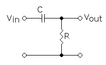

# The Art of Electronics
```
 _____ _               _         _            __ 
|_   _| |__   ___     / \   _ __| |_    ___  / _|
  | | | '_ \ / _ \   / _ \ | '__| __|  / _ \| |_ 
  | | | | | |  __/  / ___ \| |  | |_  | (_) |  _|
  |_| |_| |_|\___| /_/   \_\_|   \__|  \___/|_|  
                                                 
 _____ _           _                   _          
| ____| | ___  ___| |_ _ __ ___  _ __ (_) ___ ___ 
|  _| | |/ _ \/ __| __| '__/ _ \| '_ \| |/ __/ __|
| |___| |  __/ (__| |_| | | (_) | | | | | (__\__ \
|_____|_|\___|\___|\__|_|  \___/|_| |_|_|\___|___/
                                                  
```
[toc]
## 第一章 电子学基础
### 1.3 信号
#### 1.3.2 信号幅度与分贝
以信号幅值计算  

$$
dB = 20 \lg \frac{A_2}{A_1}
$$

以信号功率计算  

$$
dB = 10 \lg \frac{P_2}{P_1}
$$

### 1.6 阻抗与电抗
#### 1.6.1 电抗电路的频率分析
##### 电压与电流的复数表示
引入: 单个数值同时表示关于幅值与相位的信息   

$$
V = V_0 e^{j \phi}
$$

$$
V(t) = Re(Ve^{j \omega t})
$$

##### 电容与电感的电抗
电容:  

$$
V(t) = Re(Ve^{j \omega t})
$$

$$
I(t) = C(\mathrm d v / \mathrm d t)
$$

$$
I(t) = -V_0 C \omega \sin \omega t = Re(\frac{V_0 e^{j \omega t}}{\frac{1}{j \omega C}})
$$

$$
\implies X_c = \frac{1}{j \omega C}
$$

同理,对电感:  

$$
X_l = j \omega L
$$

##### 复欧姆定律

$$
I = V / Z
$$

##### 电抗电路中的功率

$$
P = Re(VI^*) = Re(V^* I)
$$

其中V与I为复均方根值  
上式由复数点积定义规定,共轭为保证复数自乘时自恰  

$$
功率因数 = \frac{功率}{|V||I|}
$$

功率因数取值范围从0(纯电抗)到1(纯电阻)
#### 1.6.2 RC滤波器
##### 高通滤波器
<p style="text-align: center;"></p>  
图片显示了一个由电容和电阻构成的分压电路,由复欧姆定律可得  

$$
I = \frac{V_{in}}{Z_{total}} = \frac{V_{in}}{R-(j/\omega C)} = \frac{V_{in}[R+(j/\omega C)]}{R^2 + (1/\omega^2 C^2)}
$$

这样,电阻两端的电压就是  

$$
V_{out} = IZ_R = \frac{V_{in}[R+(j/\omega C)]}{R^2 + (1/\omega^2 C^2)}
$$

我们只关心幅度,不关心相位  

$$
V_{out} = \sqrt {(V_{out}V_{out}^*)} = \frac{R}{[R^2+(1/\omega^2 C^2)]^{1/2}} V_{in}
$$

工程中,取-3dB(功率一半)为截止点,计算得

$$
f_{3dB} = \frac{1}{2 \pi RC}
$$

相移: 经验准则是0.1 f3dB与10 f3dB的相移大概是6度
##### 电容与电感的对偶
使用电感与电阻结合也可以构成低通或高通滤波器,但实际中很少看到RL滤波器。因为电感比电容笨重,价格更贵,而且特性也不如电容好。除非在高频电路中
#### 1.6.5 谐振电路与有源滤波器
并联LC谐振电路:  
<p style="text-align: center;"></p>  

$$
f_0 = 1/2 \pi \sqrt{LC}
$$

时阻抗为无穷大,使得该频率点上的响应值为一个峰值  
串联LC谐振电路与之相反,为一个谷值  
<p style="text-align: center;"></p>  
实际上,电容与电感的耗损会限制峰值的尖锐度,[品质因数Q][ref1]就是对曲线峰值尖锐度的衡量。它等于-3dB处的频率宽度除以谐振频率  
#### 1.6.7 戴维南定理推广
任何包含电阻、电感、电容与信号源的二端网络可等效为一个复阻抗与一个信号源的串联  

### 1.7 二极管与二极管电路
#### 1.7.1 二极管
<p style="text-align: center;"></p>  

1. 二极管实际上不具有电阻(因而不遵从欧姆定律)
2. 如果把二极管接入某电路,则该电路将没有戴维南等效

#### 1.7.3 电源滤波
<p style="text-align: center;"></p>  
在以上电路中,串联电阻时不必要的,可以省略,理由是整流器中的二极管能组织电流从电容回流,电容也就能比传统低通滤波器中的C更能作为储能单元。在电容中储存的能量是  

$$
U = \frac{CV^2}{2}
$$

电容值的选择要使

$$
R_{load}C >> 1/f
$$

其中f是波纹频率,应使放电常数远大于重新充电时间

##### 波纹电压的计算
<p style="text-align: center;"></p>  
负载会引起电容在一个周期间(全波整流的半个周期)稍微放电,假设负载电流保持不变  

$$
I = C \frac{\mathrm dV}{\mathrm dt} \implies \Delta V = \frac{I}{C} \Delta t
$$

用1/f(或1/2f,对于全波整流)带入上式(这种估算比较安全,因为电容在小于半个周期内再次充电)

$$
\Delta V = \frac{I_{load}}{fC} \tag{半波}
$$

$$
\Delta V = \frac{I_{load}}{2fC} \tag{全波}
$$

如果要做精确计算,需要用精确的指数放电公式,但实际上并无必要,理由如下:
1. 仅当负载是电阻性的,放电才是指数型的,但许多负载并不如此
2. 电源中的电容精度通常是20%或更高,可进行保守设计(考虑最差情形组合)

#### 1.7.6 二极管应用

1. 信号检波器
2. 二极管门电路
3. 二极管钳位器
4. 限幅器

[ref1]: https://zh.wikipedia.org/wiki/%E5%93%81%E8%B3%AA%E5%9B%A0%E5%AD%90
